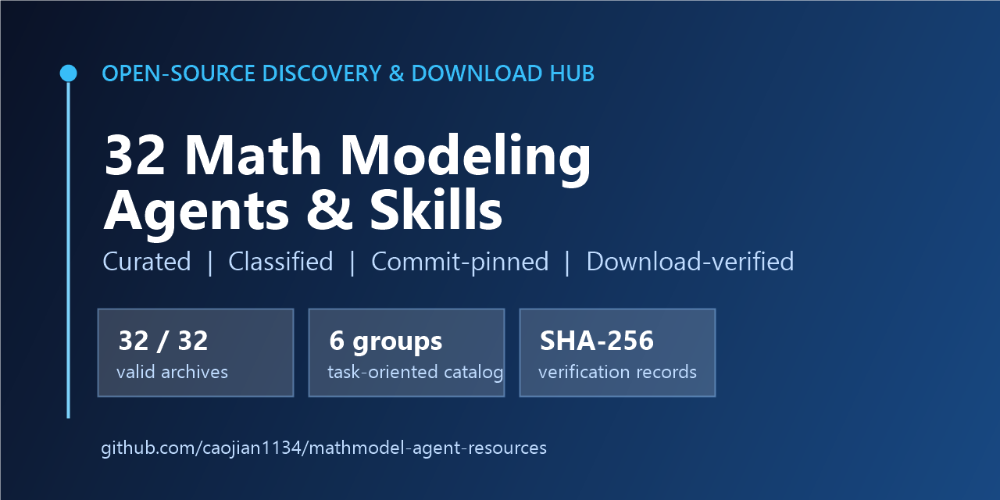

# 数学建模 Agent 与 Skills 资源中心

> 汇总、分类并验证 **32 个数学建模 AI Agent、Skills、优化工具、算法、模板与赛题资源**，支持固定版本下载和一键批量下载。

[English](./README.md) | [中文](./README_CN.md)

[](./CATALOG.md)
[](./DOWNLOADS.md)
[](./LICENSE)
[](./docs/evaluation-method.md)



本仓库面向数学建模学习者、参赛队伍和工具开发者，覆盖 CUMCM、MCM/ICM、开放式数学建模、运筹优化、数据分析、可复现计算与竞赛论文写作。

它不只是一个链接收藏夹：32 个项目均记录了检查时的版本，其中可下载项目已经在 **2026-09-06** 完成完整 ZIP 下载与有效性验证。

## 为什么建立这个目录

随着 AI Agent 和 `SKILL.md` 工作流快速增加，使用者很难立即判断：

1. 哪个项目适合自己的题目和工作阶段；
2. 它是完整 Agent、竞赛工作流、单项 Skill、求解工具、算法库还是模板；
3. 能否获得与目录检查时完全一致的版本。

因此，本仓库提供：

- 32 个公开项目的分类目录；
- 面向实际需求的[选择指南与横向对比表](./docs/project-selection-guide.md)；
- 固定到 commit 的可复现下载地址；
- 单项下载和一键批量下载工具；
- 文件大小与 SHA-256 校验记录；
- 明确的安全、许可证、可复现性和比赛合规边界。

## 快速选择

| 你的需求 | 建议先看 |
|---|---|
| 完整比赛流程、检查点和结果冻结 | `handsomeZR/mathmodel-skill`、`Hjdd14/math-modeling`、`xuec699/math-modeling-skills` |
| 多角色或多 Skill 工具组合 | `chengziyue1222/math-model-agent`、`zhnnky329/MathModeling-skills`、`yushui2022/MathModel-Skill` |
| 研究开放式数学建模 Agent | `ModelingAgent`、`LLM-MM-Agent` |
| 运筹优化与求解器反馈 | `ORLM`、`solver-in-the-loop`、`ReSocratic`、`LLM4OPT` |
| Python 或 MATLAB 算法示例 | `MathematicalModelingAlgorithm`、`fanjufei/CUMCM` |
| CUMCM 或 MCM/ICM LaTeX 模板 | `CUMCM2026-Template`、`CUMCMThesis`、`jayxin/cumcm`、`MCM-Template`、`icmmcm` |
| 国赛历年题目和附件 | `CosmicLinks/cumcm-problems` |

这些只是导航建议，不代表质量排名、认证或推荐。正式选择前请阅读[完整对比指南](./docs/project-selection-guide.md)。

## 一键下载全部 32 个项目

```powershell
git clone https://github.com/caojian1134/mathmodel-agent-resources.git
cd mathmodel-agent-resources
python scripts/download_all.py --destination project-archives --workers 4
```

Windows 用户也可以运行：

```powershell
.\scripts\download_all.ps1 -Destination .\project-archives
```

下载器读取 [`data/downloads.csv`](./data/downloads.csv)，跳过已经验证有效的 ZIP，并生成大小和 SHA-256 报告。需要逐项下载时，请打开[下载中心](./DOWNLOADS.md)。

### 已验证快照

- 检查日期：**2026-09-06**
- 有效 ZIP：**32/32**
- 失败：**0**
- 总大小：**1,368,959,922 字节（约 1.275 GiB）**
- 校验记录：[`data/verified-downloads-2026-09-06.csv`](./data/verified-downloads-2026-09-06.csv)

压缩包直接来自各项目的原始 GitHub 仓库。本仓库不会替第三方项目重新授权。部分上游项目没有明确许可证，使用、修改或再分发前必须核对上游许可状态。

## 32 个项目的构成

| 类别 | 数量 | 示例 |
|---|---:|---|
| 开放式数学建模 Agent | 2 | ModelingAgent、LLM-MM-Agent |
| 竞赛 Skills、Agent 与 Starter | 16 | math-model-agent、MathModel-Skill、MCM-AI-Starter-Kit |
| Agent 支撑、优化与评测 | 6 | AgenticDataBench、ORLM、solver-in-the-loop |
| 算法代码 | 2 | MathematicalModelingAlgorithm、CUMCM |
| 排版模板 | 5 | CUMCMThesis、MCM-Template、icmmcm |
| 历年赛题与附件 | 1 | cumcm-problems |

全部项目链接和一句话说明见 [`CATALOG.md`](./CATALOG.md)；快照 commit、许可证观察结果和 `SKILL.md` 数量见 [`data/projects.csv`](./data/projects.csv)。

## 推荐使用流程

1. 确认比赛名称、题目、截止时间和当届官方规则；
2. 只选择一套主工作流，避免多个编排器互相覆盖；
3. 根据题型选择 SciPy、CVXPY、OR-Tools、Pyomo、SALib 或 Mesa 等确定性工具；
4. 保留原始数据、模型假设、代码版本、随机种子和结果清单；
5. 使用基线、敏感性分析、边界测试和独立复算验证结果；
6. 按比赛要求披露 AI 工具、关键交互和人工修改。

## 重要边界

- 收录不代表推荐、认证、安全审查通过或比赛合规；
- `SKILL.md` 可能要求 Agent 执行命令、访问网络或修改文件，安装前必须人工审阅；
- 公开但没有许可证的仓库不等于可以任意使用或再分发；
- 第三方模板可能不符合最新的页数、匿名、字体或提交要求；
- AI 输出不能替代模型有效性证明、代码复现和人工责任；
- 比赛进行期间，不得违反禁止队外交流或公开讨论赛题的规定。

## 参与维护

欢迎补充项目、修正描述、报告失效链接、提交可复现测试或完善分类。提交前请阅读 [`CONTRIBUTING.md`](./CONTRIBUTING.md)、[`CODE_OF_CONDUCT.md`](./CODE_OF_CONDUCT.md) 和[收录与检查方法](./docs/evaluation-method.md)。

如果这个目录节省了你的检索和下载时间，欢迎点 Star，让更多建模队伍能够发现它。比 Star 更有价值的是可核验的纠错、测试记录和贡献。

## 许可与致谢

本仓库原创目录、说明和维护脚本采用 [MIT License](./LICENSE)。该许可**不覆盖**链接到的第三方项目；第三方内容继续受其原许可证和版权约束。

感谢所有上游项目维护者。项目作者如需更正介绍、补充许可证信息或移除条目，欢迎提交 Issue。
